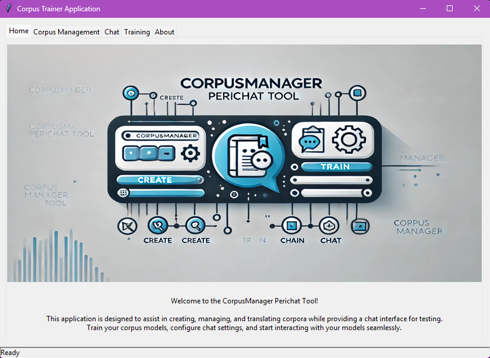
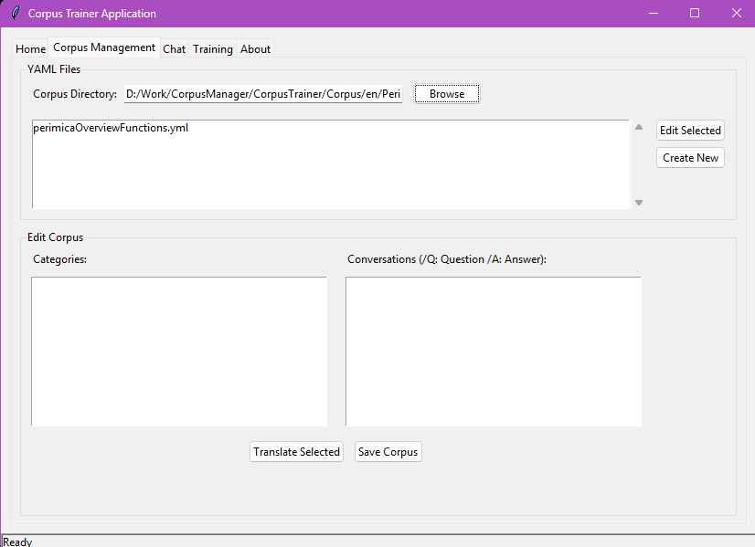
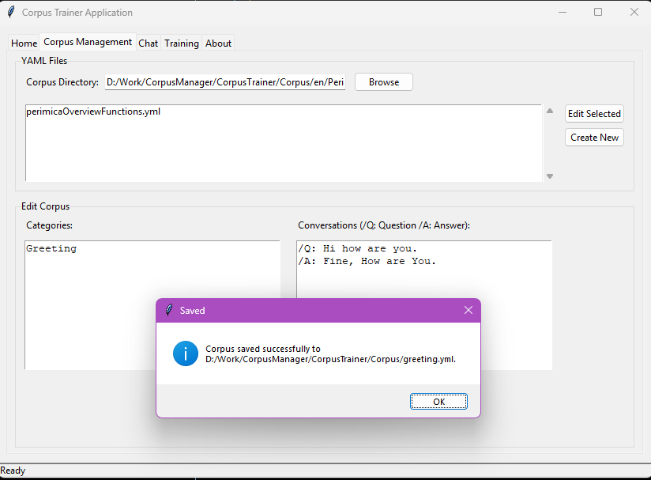
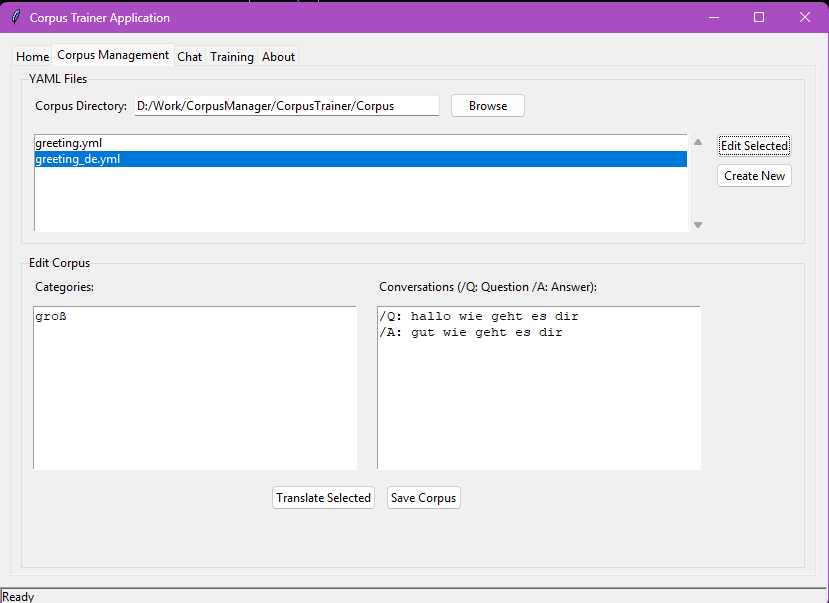
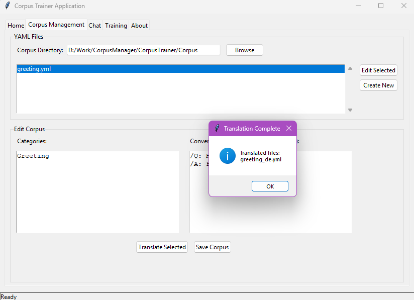
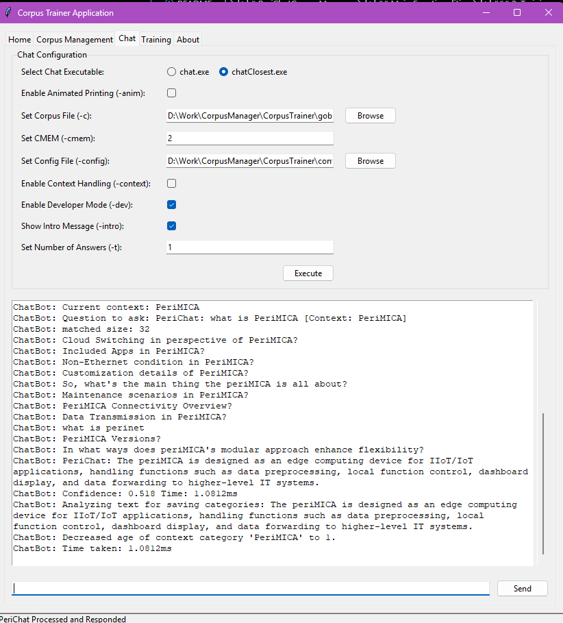

# PeriChatCorpusManager


## Main Functionalities

### 1. Corpus Management


- **Create**: Add new corpora with categories and conversations.
- 
- **Edit**: Modify existing YAML-based corpora.
- 
- **Translate**: Automatically translate and correct corpora into other languages (German).
- 
- **Save**: Save and manage corpora for future use.
---

### 2. Training
- Use `train.exe` to train models with selected configurations and corpora.
- Specify training parameters such as `config.yaml` and Corpus Directory and output GOB filename.
- Monitor and log training progress.
- 

---

### 3. Chat Interaction
- Utilize `chat.exe` or `chatClosest.exe` for real-time conversations. BOth binaries have some functionality difference not in the context of speed.
- 
---

### 4. Web Implementation Support
- This tool can be used to Prepares GOB and Etc files for integration with web tools.
- Facilitates usage in deployment pipelines like the WebImplementor.

---

## Dependencies

- **Executables**:
  - `chat.exe`, `chatClosest.exe`, `train.exe` from PeriChatEngine Releases from main cli/chat and cli/train
- **Config Files**:
  - `config_local.yaml`
- **etc Folder Dependency**
  - for Custom Dictionary and Vocabulary support
- **Additional Resources**:
  - GOB and YAML files
  - Logo (`logo.png`)

---

## How to Use

1. Launch the GUI application:
   ```bash
   python gui_trainer.py


# About
**Version: 1.0.0**

This tool combines corpus management and chat functionality for efficient model training and testing.

## Features:
- **Create and edit corpora**
- **Translate corpora into multiple languages**
- **Train models using advanced configurations**
- **Interact with trained models via chat**

---

**Developed by:**  
Cecil Joseph