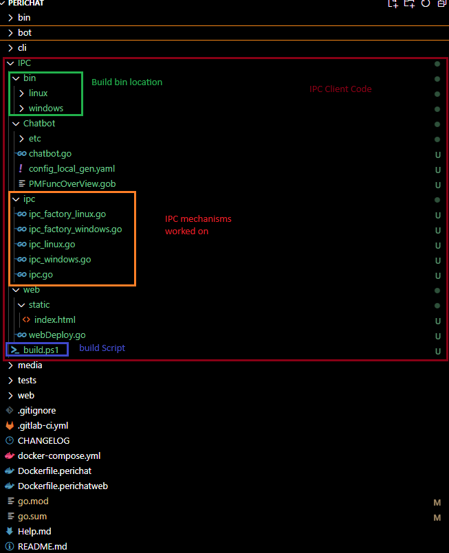

# PeriChat IPC Implementation Guide

## Table of Contents

- [PeriChat IPC Implementation Guide](#perichat-ipc-implementation-guide)
  - [Table of Contents](#table-of-contents)
  - [Introduction](#introduction)
  - [Inter-Process Communication (IPC) Implementation](#inter-process-communication-ipc-implementation)
    - [Windows IPC Implementation](#windows-ipc-implementation)
    - [Linux IPC Implementation](#linux-ipc-implementation)
  - [Implementation Flow](#implementation-flow)
  - [Service Algorithms](#service-algorithms)
    - [Chatbot Service Algorithm](#chatbot-service-algorithm)
    - [WebDeploy Service Algorithm](#webdeploy-service-algorithm)
  - [Conclusion](#conclusion)

---

## Introduction

Welcome to the **PeriChat IPC Implementation Guide**. This document outlines the algorithms and IPC mechanisms employed to facilitate communication between the `Chatbot` and `WebDeploy` services. The focus is on understanding the IPC changes and the implementation flow to ensure seamless interaction between these components across different operating systems.

---

## Inter-Process Communication (IPC) Implementation

Effective IPC is crucial for enabling real-time and reliable communication between the `Chatbot` and `WebDeploy` services. The implementation leverages platform-specific IPC mechanisms to ensure compatibility and performance.

### Windows IPC Implementation

**Mechanism Used:** **Named Pipes**

**Overview:**

- **Chatbot Service as IPC Server:**
  - Initializes a named pipe server using a designated pipe name (e.g., `\\.\pipe\chatbot_pipe`).
  - Listens for incoming connections from the `WebDeploy` client.
  - Handles one connection at a time to ensure thread safety and consistent message handling.

- **WebDeploy Service as IPC Client:**
  - Initiates a connection to the named pipe server established by the `Chatbot`.
  - Sends user messages to the `Chatbot` and awaits responses.

**Key Changes:**

- **Centralization of IPC:**
  - Both services reference the same named pipe path, ensuring all IPC communication occurs through this centralized channel.
  
- **Thread Safety:**
  - Mutexes are employed to manage concurrent access to the named pipe, preventing race conditions and ensuring data integrity during message exchanges.

### Linux IPC Implementation

**Mechanism Used:** **Unix Domain Sockets**

**Overview:**

- **Chatbot Service as IPC Server:**
  - Creates a Unix Domain Socket at a specified file path (e.g., `/tmp/chatbot_socket`).
  - Listens for incoming client connections from the `WebDeploy` service.
  - Manages a single client connection to maintain consistent communication flow.

- **WebDeploy Service as IPC Client:**
  - Connects to the Unix Domain Socket established by the `Chatbot`.
  - Facilitates the sending and receiving of messages between the user interface and the `Chatbot`.

**Key Changes:**

- **Unified Socket Path:**
  - Both services utilize the same Unix socket path, ensuring centralized IPC communication.
  
- **Connection Management:**
  - Mutexes and proper synchronization techniques handle multiple concurrent message exchanges without conflicts.

---

## Implementation Flow

The interaction between the `WebDeploy` and `Chatbot` services via IPC follows a structured flow to ensure efficient and reliable communication. Below is a step-by-step overview of the communication process:

1. **Initialization:**
    - **Chatbot Service:**
        - Starts and initializes the IPC server (Named Pipe on Windows or Unix Domain Socket on Linux).
        - Waits for incoming connections from the `WebDeploy` client.
    
    - **WebDeploy Service:**
        - Starts and initializes the IPC client.
        - Connects to the `Chatbot`'s IPC server using the designated IPC mechanism.

2. **User Interaction:**
    - A user interacts with the web interface served by the `WebDeploy` service, submitting a query or message.

3. **Message Dispatch:**
    - **WebDeploy Service:**
        - Captures the user's message.
        - Wraps the message in a structured format (e.g., JSON) with a unique `RequestID` for tracking.
        - Sends the message to the `Chatbot` via the established IPC channel.

4. **Message Processing:**
    - **Chatbot Service:**
        - Receives the incoming message through the IPC channel.
        - Parses and processes the message using its NLP and response generation logic.
        - Constructs a response, maintaining the same `RequestID` to correlate with the original request.
        - Sends the response back to the `WebDeploy` service via IPC.

5. **Response Handling:**
    - **WebDeploy Service:**
        - Receives the response from the `Chatbot` through IPC.
        - Matches the `RequestID` to ensure the response corresponds to the correct user query.
        - Sends the `Reply` back to the user through the web interface or WebSocket.

6. **Concurrency and Synchronization:**
    - Both services employ mutexes and synchronization mechanisms to handle multiple simultaneous messages without data races or inconsistencies.

7. **Termination:**
    - Upon shutdown, both services gracefully close their IPC connections, ensuring no dangling resources or incomplete message transmissions.

**Visual Representation:**

User <--> WebDeploy <--> IPC (Named Pipe / Unix Socket) <--> Chatbot

## Service Algorithms

### Chatbot Service Algorithm

**Purpose:** To receive messages from the `WebDeploy` service, process them using natural language processing (NLP), and return appropriate responses.

**Algorithm Steps:**

1. **Start IPC Server:**
    - Initialize the IPC server using the appropriate mechanism based on the operating system.
    - Begin listening for incoming connections from the `WebDeploy` service.

2. **Await Connection:**
    - Block and wait until a client (`WebDeploy`) establishes a connection via IPC.

3. **Message Reception Loop:**
    - Continuously listen for incoming messages through the IPC channel.
    - For each received message:
        - Parse the message structure to extract the `RequestID` and user `Message`.
        - Log the received message for debugging or audit purposes.

4. **Process Message:**
    - Utilize NLP libraries and algorithms to understand and interpret the user's message.
    - Generate a coherent and contextually appropriate response based on the processed input.

5. **Construct Response:**
    - Create a response object that includes:
        - The original `RequestID` to maintain correlation.
        - The generated `Reply` message.

6. **Send Response:**
    - Serialize the response object into the agreed-upon format (e.g., JSON).
    - Transmit the serialized response back to the `WebDeploy` service via IPC.

7. **Handle Errors:**
    - If any errors occur during message processing or response generation:
        - Log the error details.
        - Send an error response back to the `WebDeploy` service, including the `RequestID` and error information.

8. **Graceful Shutdown:**
    - Monitor for termination signals (e.g., SIGINT, SIGTERM).
    - Upon receiving a shutdown signal:
        - Close the IPC connection gracefully.
        - Perform any necessary cleanup operations before exiting.

### WebDeploy Service Algorithm

**Purpose:** To serve the web interface, capture user inputs, communicate with the `Chatbot` service via IPC, and relay responses back to the user.

**Algorithm Steps:**

1. **Initialize IPC Client:**
    - Establish a connection to the `Chatbot` service's IPC server using the appropriate mechanism based on the operating system.

2. **Start Web Server:**
    - Configure and launch the web server to serve static files and handle HTTP requests.
    - Optionally, enable WebSocket endpoints for real-time communication.

3. **Handle User Requests:**
    - For each incoming user interaction (e.g., form submission, WebSocket message):
        - Capture the user's message from the web interface.

4. **Prepare Message for Chatbot:**
    - Generate a unique `RequestID` to track the message-response pair.
    - Construct a structured message object containing:
        - The `RequestID`.
        - The user's `Message`.

5. **Send Message via IPC:**
    - Serialize the message object into the agreed-upon format (e.g., JSON).
    - Transmit the serialized message to the `Chatbot` service through the established IPC channel.

6. **Await Response:**
    - Listen for a response from the `Chatbot` via IPC.
    - Upon receiving a response:
        - Deserialize the response object.
        - Verify that the `RequestID` matches the original request to ensure correct correlation.

7. **Relay Response to User:**
    - Extract the `Reply` message from the response object.
    - Send the `Reply` back to the user's web interface, either through HTTP response or WebSocket message.

8. **Handle Errors:**
    - If any errors occur during message transmission or response handling:
        - Log the error details for debugging.
        - Inform the user of the failure through the web interface, ensuring transparency.

9. **Concurrency Management:**
    - Utilize mutexes and synchronization techniques to handle multiple simultaneous user interactions without data conflicts or race conditions.

10. **Graceful Shutdown:**
    - Monitor for termination signals (e.g., SIGINT, SIGTERM).
    - Upon receiving a shutdown signal:
        - Close the IPC connection gracefully.
        - Shut down the web server, ensuring all active connections are properly terminated.
        - Perform any necessary cleanup operations before exiting.

---

## Conclusion

The **PeriChat IPC Implementation** establishes a robust communication framework between the `Chatbot` and `WebDeploy` services using platform-specific IPC mechanisms. By leveraging Named Pipes for Windows and Unix Domain Sockets for Linux, the system ensures efficient and reliable inter-service communication essential for delivering a seamless user experience.