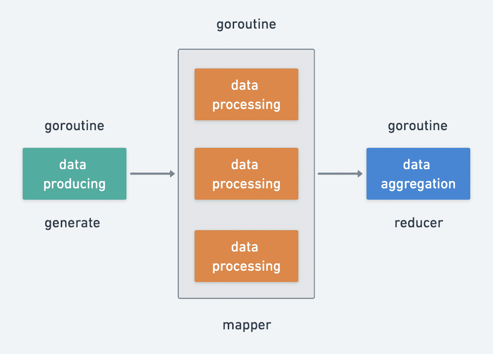
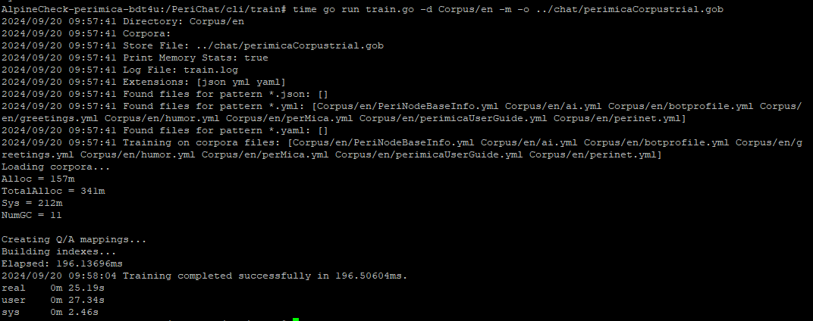
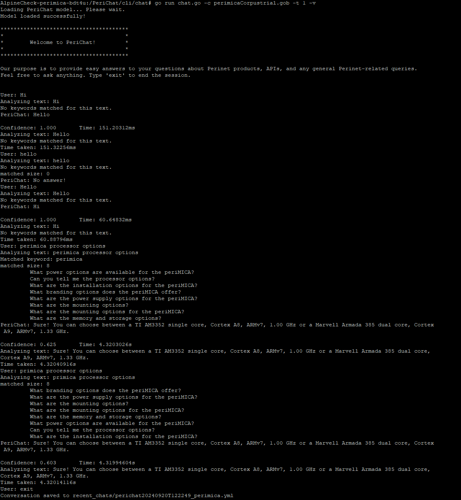
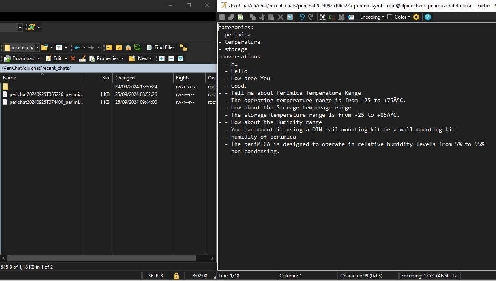
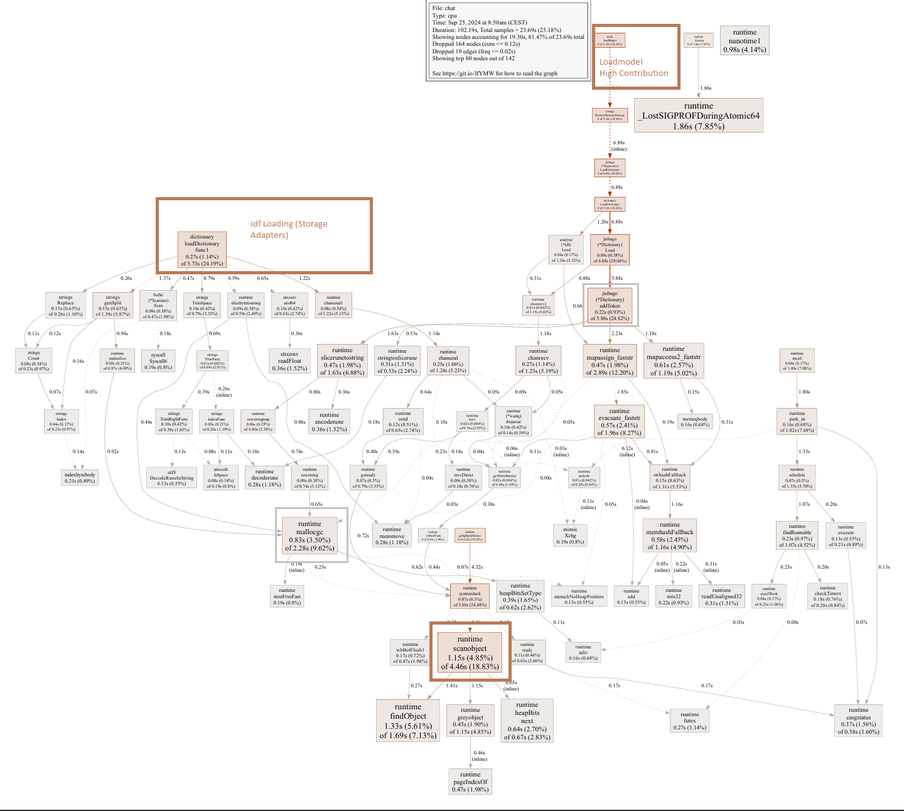
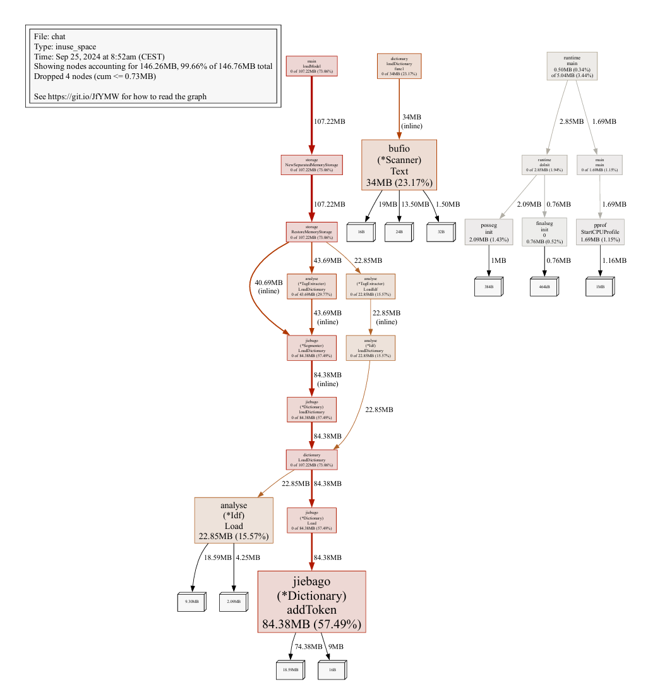
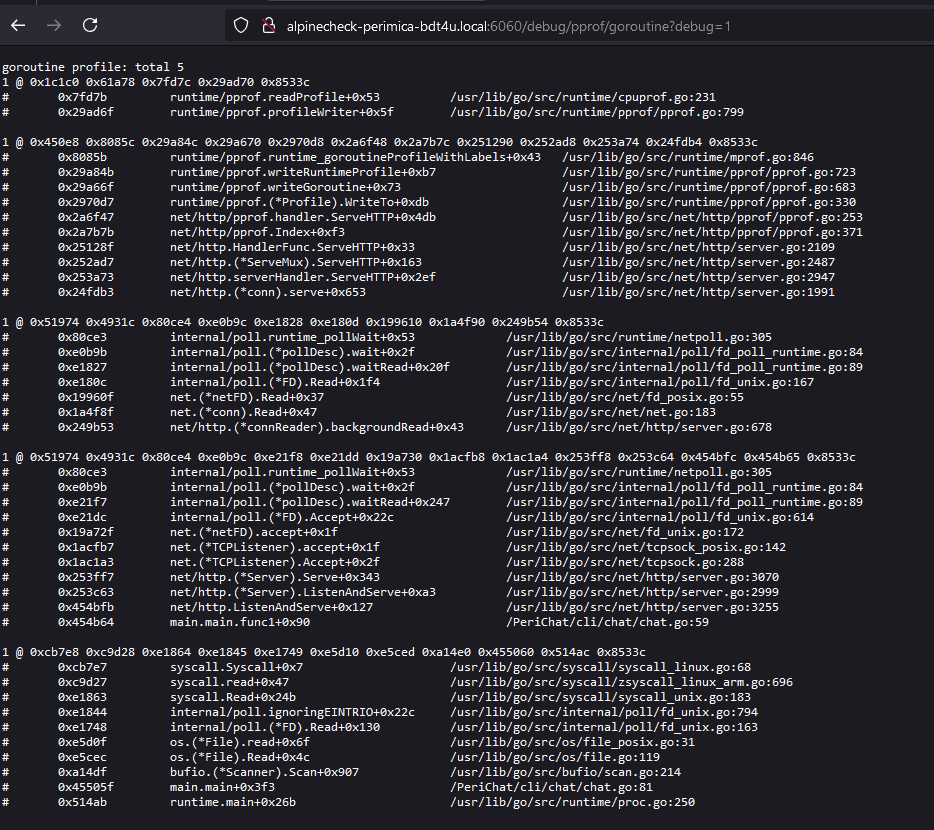

# Go-based Chatbot with NLP and MapReduce

**[Chatbot MRGO Version Wiki ](https://perinet.atlassian.net/wiki/spaces/PDCTRES/pages/2841444353/Go-Based+Chatbot+A+MR+approach)**  
The chatbot leverages **Natural Language Processing (NLP)** and **MapReduce (MR)** for efficient data processing and response generation. Built using the Go programming language, it handles complex data aggregation tasks and provides fast, accurate responses to user queries.

## Key Features

- **High-speed ML inferencing**: Utilizing NLP techniques to understand and respond to user inputs.
- **MapReduce Integration**: Efficiently processes large datasets concurrently to improve performance and response time.

## MapReduce in the Chatbot

### Why MapReduce?

In business scenarios, fetching data from multiple services (e.g., product, inventory, price, marketing) sequentially increases response time. MapReduce allows for **parallel data fetching and aggregation**, improving overall efficiency.

### Design Overview

The data processing lifecycle is divided into three phases:

1. **Data Production**: Fetching or generating data.
2. **Data Processing**: Independently processing each piece of data.
3. **Data Aggregation**: Combining processed data for the final result.

By utilizing Go's **goroutines** and **channels**, the chatbot performs concurrent processing with efficient error handling and flexibility in logic application.

## Natural Language Processing (NLP)

### Role of NLP

NLP enables the chatbot to understand user inputs and generate appropriate responses. Key processes include:

- **Tokenization**: Breaking down text into words or phrases.
- **Normalization**: Standardizing text.
- **Stemming/Lemmatization**: Reducing words to their root forms.
- **Vectorization**: Representing text numerically for comparison.

### Query Processing

When a user asks a question:

1. The input is preprocessed (tokenization, normalization).
2. The question is vectorized and compared to stored questions.
3. The most similar response is selected and presented.

## Enhancing Accuracy with MapReduce

The chatbot leverages MapReduce for:

- **Parallel processing** of large conversation datasets.
- **Efficient indexing** for quick data retrieval.
- **Scalability** without significant performance hits.

## Training and Query Script Usage

The chatbot uses YAML-based corpora for training and interactions. The training script supports various options for customizing the behavior, such as specifying directories, corpora files, and output formats. 

### Command-Line Options:

- `-d`: Specify the directory to search for corpora files.
- `-i`: Provide individual corpora files.
- `-o`: Define the output file for trained data.
- `-m`: Print memory statistics during training.
- `-log`: Specify the log file for detailed execution logs.
- `-ext`: Define file extensions for corpora files.

for training:

    go run train.go -d Corpus/en -m -o ../chat/perimicaCorpustrial.gob

## Profiling and Performance Optimization

To ensure the chatbot's performance, Go's **pprof** tool is used for **CPU, memory, and HTTP profiling**. Profiling helps identify resource bottlenecks and optimize performance.

for Inference:

    go run chat.go -c perimicaCorpustrial.gob -t 1 -cpuprofile=cpu.prof -http=6060 -memprofile=mem.prof

Here's a demonstration of how the chatbot works:

chatbot usage with MR working and confidence scoring

The Recent Chat History feature is also implemented for enhanced interactive training, allowing the system to save conversations. If a question remains unanswered, the chat history can be stored and sent to developers for retraining purposes.

Recent Chats with Automatic Category filtering.

### Profiling Types:

- **CPU Profiling**: Identifies functions consuming the most processing power.

- **Memory Profiling**: Detects memory leaks and heavy memory allocations.

- **HTTP Profiling**: Monitors real-time profiling via HTTP endpoints.

## Requirements and Future Considerations

The current challenge is the limited corpus data, which affects the chatbot's ability to handle a wide range of queries. Expanding the dataset will improve the chatbot's accuracy and interactivity. The same corpus can also be used for **Retrieval-Augmented Generation (RAG)** and GPT-based approaches, providing flexibility in future AI solutions.

## Acknowledgements

- **[go-zero](https://github.com/zeromicro/go-zero)**  
  The MapReduce implementation in the `core/mr` package provides a significant performance boost for the chatbot.

- **[ChatterBot](https://github.com/gunthercox/ChatterBot)**  
  An open-source machine learning conversational dialog engine that serves as a major inspiration for this project's development.

- **[Chatbot](https://github.com/kevwan/chatbot/)**  
  Chatbot - An Advancement Engine used in the project, any NLP and engine changes were implemented on top of this.

Initial Fork from kevwan/chatbot

Main Version owned By Cecil Joseph - ceciljoseph97/chatbot

